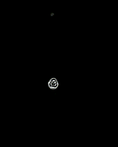

# POGL - Cellular automatons

This project is led by [@oscarmorand](https://github.com/oscarmorand) and [@ahmedhassayoune](https://github.com/ahmedhassayoune) at french software engineering school EPITA.
It is a Shadertoy implementation of [cellular automatons](https://en.wikipedia.org/wiki/Cellular_automaton) (1D Rules, 2D Rules, game of life, Smooth Life, Lenia).

# How to run the shaders

To run the shaders, you can install the vscode extension [Shader Toy](https://marketplace.visualstudio.com/items?itemName=stevensona.shader-toy) by *Adam Stevenson*. You can then open the different shaders in the `src` folder and run them `Ctrl+Shift+P` -> `Shader Toy: Show GLSL Preview`.

These shaders are also available online on [Shadertoy](https://www.shadertoy.com). You can find the links to the online shaders in the list below.

### Note
The shaders with multiple files `*_1, *_2, *_3` represent the same shader and need to be launched from the first shader `*_1`.

# Shaders list
**🚨 Warning: Some shaders may be harmful to people with photosensitive epilepsy!**

## 1D Shaders
With these shaders, you can play with the `gen_nb_frames` parameter to slow down the time, the `isRandom` boolean parameter to switch between single-cell initialisation or random initialisation. For the random one, you can change the `density` parameter to play with the number of cells.
- Rule 90 [online shader](https://www.shadertoy.com/view/4cXcz8) ([wiki](https://en.wikipedia.org/wiki/Rule_90))
- Rule 110 [online shader](https://www.shadertoy.com/view/XcXcz8) ([wiki](https://en.wikipedia.org/wiki/Rule_110))
- Rule 184 [online shader](https://www.shadertoy.com/view/4cfcz8) ([wiki](https://en.wikipedia.org/wiki/Rule_184))

  <figure style="display: inline-block; margin-right: 10px;">
    
  </figure>
  <figure style="display: inline-block; margin-right: 10px;">
    
  </figure>
  <figure style="display: inline-block;">
    
  </figure>

## 2D Basic Shaders

With these shaders, you can play with the `gen_nb_frames` parameter to slow down the time and `scale` parameter to zoom in. You can also interact with them by clicking with your mouse on the rendering screen. Each one of them has their own parameters you can play with to change the simulation sequence.
- Belooussov-Jabotinski reaction [online shader](https://www.shadertoy.com/view/MflyDn) ([wiki](https://en.wikipedia.org/wiki/Belousov%E2%80%93Zhabotinsky_reaction))
- Viral Replication [online shader](https://www.shadertoy.com/view/XcfyW8) ([doc](https://www.hermetic.ch/pca/vr.htm))
- Game of life [online shader](https://www.shadertoy.com/view/lXyXzG) ([wiki](https://en.wikipedia.org/wiki/Conway%27s_Game_of_Life))

  <figure style="display: inline-block; margin-right: 10px;">
    
  </figure>
  <figure style="display: inline-block; margin-right: 10px;">
    
  </figure>
  <figure style="display: inline-block;">
    
  </figure>

## Smooth Life
- Smooth Life discrete time-stepping [online shader](https://www.shadertoy.com/view/XcscW7)
- Smooth Life continuous time-stepping [online shader](https://www.shadertoy.com/view/4clyD7)
- Gaussian Smooth Life [online shader](https://www.shadertoy.com/view/XflcD7)

  <figure style="display: inline-block; margin-right: 10px;">
    
  </figure>
  <figure style="display: inline-block; margin-right: 10px;">
    
  </figure>
  <figure style="display: inline-block;">
    
  </figure>

- Smooth Life color 1 [online shader](https://www.shadertoy.com/view/4flyD7)
- Smooth Life color 2 [online shader](https://www.shadertoy.com/view/XcsyD7)

  <figure style="display: inline-block; margin-right: 10px;">
    
  </figure>
  <figure style="display: inline-block;">
    
  </figure>

- Smooth Life optimized [online shader](https://www.shadertoy.com/view/XclcD7)
- Optimized Gaussian Smooth Life [online shader](https://www.shadertoy.com/view/4fscD7)

  <figure style="display: inline-block; margin-right: 10px;">
    
  </figure>
  <figure style="display: inline-block;">
    
  </figure>

## Lenia
- Lenia Orbium [online shader](https://www.shadertoy.com/view/4flcD7)
- Lenia Quadrium [online shader](https://www.shadertoy.com/view/XcscD7)

  <figure style="display: inline-block; margin-right: 10px;">
    
  </figure>
  <figure style="display: inline-block;">
    
  </figure>

